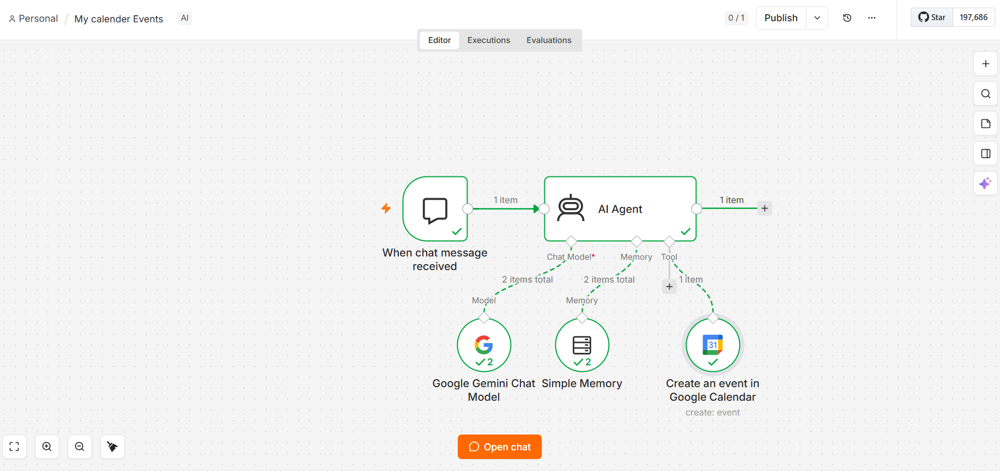

# 📅 AI Calendar Agent — n8n Workflow

An n8n automation that turns a natural-language chat message into a Google Calendar event. Just describe what you want to schedule, and an AI agent (powered by Google Gemini) interprets the request, remembers conversation context, and creates the event for you automatically.

## ✨ What It Does

Instead of manually opening Google Calendar and filling out event details, you can simply chat with the agent:

> "Schedule a team sync tomorrow at 3pm for 30 minutes"

The AI Agent parses the request, figures out the correct date/time/details, and creates the event directly in your Google Calendar.

## 🧩 How It Works

The workflow is built from the following nodes:

| Node | Role |
|---|---|
| **When chat message received** | Trigger — starts the workflow whenever a new chat message comes in |
| **AI Agent** | The core orchestrator — interprets the user's request and decides what action to take |
| **Google Gemini Chat Model** | The LLM powering the agent's reasoning and natural language understanding |
| **Simple Memory** | Retains conversation context across messages, so the agent understands follow-ups |
| **Create an event in Google Calendar** | Tool the agent calls to actually create the calendar event |

**Flow:** Chat Trigger → AI Agent (using Gemini + Memory) → Google Calendar tool → Event created ✅

## 🔧 Requirements

Before importing this workflow, make sure you have:

- An **n8n instance** (self-hosted or cloud)
- A **Google Gemini API key** ([Google AI Studio](https://aistudio.google.com/))
- A **Google Calendar OAuth2 credential** connected in n8n
- n8n's **LangChain / AI Agent nodes** enabled (included by default in recent n8n versions)

## 🚀 Setup Instructions

1. Download the [`My-Calendar-Events.json`](./My-Calendar-Events.json) workflow file from this repo.
2. In your n8n instance, go to **Workflows → Import from File** and select the JSON file.
3. Open each node and connect your own credentials:
   - **Google Gemini Chat Model** → add your Gemini API key
   - **Create an event in Google Calendar** → connect your Google account via OAuth2
4. Click **Open chat** (bottom of the canvas) to start talking to your agent.
5. Try a prompt like: *"Book a dentist appointment next Friday at 10am"*

## 💡 Example Prompts

- "Add a meeting with Sarah tomorrow at 2pm"
- "Schedule my flight reminder for August 5th at 6am"
- "Set up a recurring weekly standup every Monday at 9am"

## 🛠️ Customization Ideas

- Swap **Google Gemini** for another LLM (OpenAI, Anthropic, etc.)
- Add more tools to the AI Agent (e.g. Gmail, Slack notifications) for a fuller assistant
- Replace **Simple Memory** with a persistent memory store (e.g. Postgres/Redis) for long-term context
- Add validation/confirmation steps before events are created

## 📄 License

MIT — feel free to use, modify, and share.

## 🙌 Credits

Built with [n8n](https://n8n.io) — a powerful workflow automation tool.
